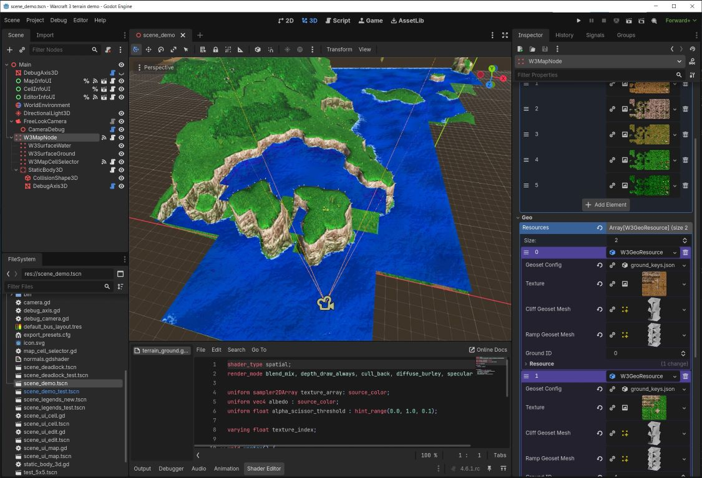

# Godot Extension: 3D Terrain for Warcraft III Maps (W3E)

A high-performance GDExtension for Godot Engine that renders Warcraft III‑style terrain (`.w3e` files) in real‑time 3D. It provides a `W3MapNode` scene node that loads W3E terrain data, manages ground and cliff assets, and renders the landscape with dynamic section culling, LOD, and efficient memory caching.



## Features

- **W3E file support** – Load and edit standard Warcraft III terrain files (`.w3e`).
- **Dynamic culling** – Uses a quadtree‑based collector to determine visible sections based on camera frustum; invisible sections are not rendered.
- **Asset management** – Assign ground textures (tilesets) and cliff/ramp meshes (geo assets) via Godot’s resource system.
- **Runtime editing** – Modify height, layer, water, and tile properties through a dedicated `W3MapBindingsEditor` resource.
- **Memory‑aware caching** – Integrates an LRU cache for section meshes and textures; old sections
-  are automatically evicted when memory limits are reached.
- **Performance monitoring** – Built‑in counters for cache allocation, visible sections, and draw calls (enabled with `W3MAP_STATS_ENABLE`).
- **Full Godot integration** – Exposes all functionality as GDExtension classes, usable from GDScript, C#, or the editor.

## Project Structure

```
.
├── src/w3terrain/          # Core C++ extension code
│   ├── w3mapnode.h/cpp     # Main Godot node (W3MapNode)
│   ├── w3e.h/cpp           # W3E file parser and data model
│   ├── w3mapassets.h       # Asset management interface
│   ├── w3mapsection.h/cpp  # Terrain section (mesh + material)
│   ├── w3mapsectionmanager.h/cpp  # Section lifecycle & cache
│   ├── w3mapcollector.h/cpp       # Quadtree‑based visibility collector
│   ├── w3mapinformator.h/cpp      # Map query utilities
│   ├── w3mapruntimemanager.h/cpp  # Runtime state & updates
│   ├── w3surfaceground.h/cpp      # Terrain surface renderer
│   └── w3surfacewater.h/cpp       # Water surface renderer
├── demo/                  # Example Godot project
│   ├── scene_demo.tscn    # Demo scene with a working terrain
│   ├── scene_deadlock.tscn
│   ├── scene_legends.tscn
│   ├── test_5x5.tscn
│   ├── test_5x9.tscn
│   ├── test_9x9.tscn
│   ├── w3_map_node.gd     # Example GDScript controller
│   ├── camera.gd          # Example GDScript camera
│   └── assets/            # Sample textures and models
├── godot‑cpp/             (submodule) Godot C++ bindings
├── lru_memory_manager/    (submodule) LRU cache implementation
├── quadtree/              (submodule) Quadtree for spatial queries
└── test/                  Unit tests (Google Test)
```

## Demo project assets

This project does not contain the original textures and resources from Warcraft 3.
Test resource stubs are used to run scene_demo_test.tscn, but if you want to see the map in its original form
with the original resources, you must first import them from the original game's mpq archive.
To get the archive with resources, install the Warcraft 3 (TFT,RoC) (for example, from https://archive.org/details/Warcraft3DemoCD) and use https://github.com/dimonp/assets_mpq_importer tools to extract the resources.  
Copy the extracted resources to the `demo/assets/imported` directory:
```
.
├── demo/assets/imported
│   ├── Geosets
│   │   ├── city_cliffs.obj
│   │   ├── city_keys.json
│   │   ├── city_ramps.obj
│   │   ├── ground_cliffs.obj
│   │   ├── ground_keys.json
│   │   └── ground_ramps.obj
│   ├── Maps/Campaign
│   │   ├── Demo01.w3e
│   │   ├── Demo02.w3e
│   │   └── Demo03.w3e
│   ├── ReplaceableTextures/Cliff
│   │   ├── Cliff0.dds
│   │   └── Cliff1.dds
│   └── TerrainArt/LordaeronSummer
│       ├── Lords_DirtGrass.dds
│       ├── Lords_DirtRough.dds
│       ├── Lords_Grass.dds
│       ├── Lords_GrassDark.dds
│       └── Lords_Rock.dds
├── TerrainArt
├── (4)Deadlock.w3e
└── legends.w3e
```

Water shader taken from https://godotshaders.com/shader/foam-edge-water-shader/

## Requirements

- **Godot 4.2+** (built with GDExtension support)
- **CMake 3.17+**
- **C++23 compiler** (GCC 13+, Clang 16+, MSVC 2022+)
- **vcpkg** (for dependency management)
- **Python 3.4+** (for build scripts)

## Building

### 1. Clone the repository with submodules

```bash
git clone --recursive https://github.com/dimonp/my_gdextension-3d-terrain-10.git
cd my_gdextension-3d-terrain-10
```

If you already cloned without `--recursive`, run:

```bash
git submodule update --init --recursive
```

### 2. Configure with CMake

```bash
mkdir build && cd build
cmake .. -DCMAKE_TOOLCHAIN_FILE=/path/to/vcpkg/scripts/buildsystems/vcpkg.cmake
```

### 3. Compile

```bash
cmake --build . --config Release
```
or
```bash
cmake --build . --config Debug
```

The compiled library (`libgdextension_w3terrain.so` on Linux, `.dll` on Windows, `.dylib` on macOS) will be placed in `bin/<platform>/` and automatically copied to `demo/bin/<platform>/`.

### 4. Run the demo

In the project folder execute:  
Windows: `\path\to\godot\binary\godot.windows.template_release.x86_64.exe --path demo`  
Linux: `/path/to/godot/binary/godot.linuxbsd.template_release.x86_64 --path ./demo`  

For the editor, you must first compile the debug version (see Building step 3)
Open the `demo/` folder in Godot Editor and run `scene_demo_test.tscn`.
Or open `scene_demo.tscn` if you previously imported resources from the MPQ.

## Usage

### Adding the extension to your project

1. Copy the `bin/` directory (containing the `w3terrain.gdextension` configuration file and the native library) into your Godot project.
2. Enable the extension in **Project → Project Settings → Plugins**.

### Creating a terrain in the editor

1. Add a `W3MapNode` node to your scene (it appears under **Node → 3D → W3MapNode**).
2. In the Inspector, assign a `.w3e` resource to the **W3e Map** property.
3. Assign ground textures (as `Texture2D` array) to **Ground Textures**.
4. Assign cliff/ramp resources (as `W3GeoResource` array) to **Geo Resources**.
5. Connect a `Camera3D` to the **Camera** property (for visibility culling).
6. Add a `W3SurfaceGround` and `W3SurfaceWater` child node under the `W3MapNode` node.
7. Run the scene – the terrain should appear.

### Scripting example

```gdscript
extends Node3D

@onready var terrain = $W3MapNode

func _ready():
    # Load a W3E file
    var w3e = load("res://path/to/map.w3e")
    terrain.w3e_map = w3e

    # Set ground textures
    var textures = [
        load("res://assets/ground/dirt.png"),
        load("res://assets/ground/grass.png"),
    ]
    terrain.ground_textures = textures

    # Set camera for culling
    terrain.camera = $Camera3D
```

### Editing terrain at runtime

Use the `W3MapBindingsEditor` resource to modify height, water, tilesets, etc.

```gdscript
var editor = terrain.editor
editor.set_cell_ground_height(Vector2i(10, 20), 15.0)
editor.set_cell_water_height(Vector2i(10, 20), 5.0)
editor.set_cell_ground_tileset(Vector2i(10, 20), 2)
```

## API Overview

### Main Classes

- **`W3MapNode`** – The core scene node. Inherits from `VisualInstance3D`.
- **`W3eResource`** – Resource wrapper for `.w3e` files.
- **`W3MapBindings`** – Read‑only interface for querying terrain data.
- **`W3MapBindingsEditor`** – Read‑write interface for modifying terrain.
- **`W3GeoResource`** – Resource that describes a cliff/ramp mesh and its texture.

### Signals

- `map_initialized(map_node: W3MapNode)` – Emitted when a new map is loaded.
- `map_destroyed(map_node: W3MapNode)` – Emitted when the current map is unloaded.
- `map_assets_changed()` – Emitted when any asset (ground/geo) changes.
- `ground_assets_changed()` – Emitted when ground textures are updated.
- `geo_assets_changed()` – Emitted when geo resources are updated.

## License

This project is released into the public domain under the **MIT License**.
See [LICENSE.txt](LICENSE.txt) for full text.

## Support

[GitHub repository](https://github.com/dimonp/w3terrain_gdextension/issues).


---

*Happy mapping!*